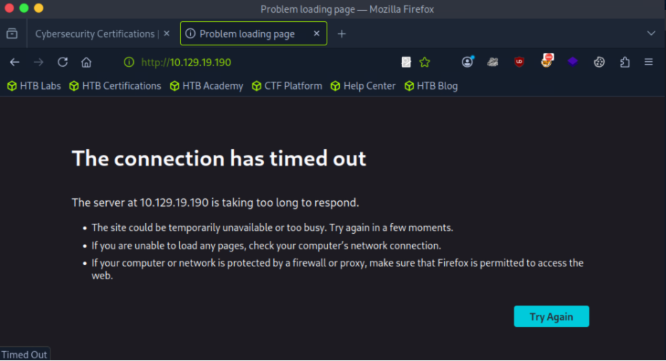

Machine Overview 
Target: Machine 01350099
Target IP: 10.129.19.190

Step 1: Discovery and Web probe

I tried to access the target through the web browser over HTTP [http://10.129.19.190] but the connection timed out. This meant that there was no web server.

Step 2: Network Reconnaissance 

Network enumeration was done using Nmap to find active services.
nmap 10.129.19.190

port 3306/tcp is open

I also used the command sudo nmap 10.129.19.190 -p- -sV -v to do a full range port scan which confirmed that was the only port open. 

Step 3: Database Authentication 

I tried a connection attempt using the client's local user but was denied. 

mysql -h 10.129.19.190 -P 3306

I was able to connect with root username without a password 
mysql -h 10.129.19.190 -P 3306 -u root

Step 4: Database Enumeration and Flag Retrieval

Once inside the MariaDB I looked around the database with the commands: 
show databases;

I found htb, information_schema, mysql, and performance_schema

I selected htb
use htb;
show tables;

select * from users;
showed all the users 

select * from config;
showed the flag

